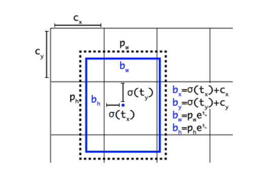

<h1 align="center">Лабораторная работа №4.</h1>

<h2 align="center">Обнаружение игровых карт</h2><br>

<p align="center"><b>Теоретическая база</b><p>


<b>Обнаружение объектов:</b>

Обнаружение объектов - это технология компьютерного зрения, которая локализует и идентифицирует объекты на изображении. Благодаря универсальности, в последние несколько лет обнаружение объектов стало наиболее часто используемой технологией компьютерного зрения.

Обнаружение объектов - это решение для компьютерного зрения, которое идентифицирует экземпляры объектов в визуальных средах. Программы обнаружения объектов рисуют ограничивающую рамку вокруг экземпляра обнаруженного объекта в сочетании с меткой для представления содержимого рамки. Например, человек на изображении может быть помечен как "человек", а автомобиль может быть помечен как "транспортное средство".

<b>Как работает обнаружение объектов?</b>

Обнаружение объектов часто называют распознаванием объектов, идентификацией объектов, обнаружением изображений, и эти понятия являются синонимами.

Обнаружение объектов, однако, не похоже на другие распространенные технологии компьютерного зрения, такие как классификация (присваивает изображению отдельный класс), обнаружение ключевых точек (определяет точки интереса на изображении) или семантическая сегментация (разделяет изображение на области с помощью масок).

Программы обнаружения объектов локализуют объекты на изображении и помечают эти объекты как принадлежащие целевому классу.

<figure>
  <p align="center"></p>
</figure>
<p align="center"><i>Графическое изображение задачи обнаружения объектов</i></p><br>

Цель обнаружения объектов: определить координаты X1, X2, Y1, Y2 и метки классов объектов. Использование обнаружения объектов в приложении просто включает ввод изображения (или видеокадра) в модель обнаружения объектов и получение выходных данных JSON с предсказанными координатами и метками классов.

<b>Моделирование обнаружения объектов:</b>

Чтобы сделать эти прогнозы, модели обнаружения объектов формируют объекты из пикселей входного изображения.

<figure>
  <p align="center"></p>
</figure>
<p align="center"><i>Формирование объектов из пикселей изображения</i></p><br>

После формирования пиксельные характеристики изображения передаются через сеть глубокого обучения

<figure>
  <p align="center"></p>
</figure>
<p align="center"><i>Схема модели обнаружения объектов</i></p><br>

и предсказания координат и классов выполняются как смещения из серии блоки привязки.

<figure>
  <p align="center"></p>
</figure>
<p align="center"><i>Прогнозы обнаружения объектов выполняются на основе блоки привязки</i></p><br>

Модель обнаружения объектов извлекает информацию из отображаемых данных. Итак, чтобы обучить модель обнаружения объектов определять интересующие нас объекты, важно собрать помеченный набор данных.

<h1><p align="center"><b>Описание разработанной системы</b><p></h1>

<b> 1.Описание подготовки архитектуру и модели</b></br>

Устанавливаем Tensorflow и импортируем
```
!pip install tensorflow

import tensorflow as tf
```

Далее установливаем модели Tensorflow

```
!git clone https://github.com/tensorflow/models.git
```

чтобы проверить где хранятся установленные файлы, используем следующие команды:

```
pwd
```

написав  ```!git clone https://github.com/cocodataset/cocoapi.git``` клонируем датасеты cocoapi из Tensorflow на папку ```cd /content/models/research ```

компилируем все файлы с помощью ```!make```

копируем утилиты coco ```cp -r pycocotools /content/models/research```. Здесь нам нужена только часть утилиты который детектирует изображения. Установим ее:

```
cp object_detection/packages/tf2/setup.py .

!python -m pip install .
```

Проверим корректно работает ли наш Tensorflow и API в тестовом режиме:

```
# From within TensorFlow/models/research/
!python object_detection/builders/model_builder_tf2_test.py
```

<b> 2.Датасеты и предобученная модель</b></br>

Загружаем и разархивируем наши предварительно обученные наборы данных:

```
!unrar x -Y "/content/training_demo.rar" "/content"
```
Далее используем предварительно обученные модели с помощю архитектуры SSD ResNet50, для того, чтобы обучать наши данные. 

Загружаем и разархивируем архитектуру SSD ResNet50:

```
!wget http://download.tensorflow.org/models/object_detection/tf2/20200711/ssd_resnet50_v1_fpn_640x640_coco17_tpu-8.tar.gz

!tar -xvf ssd_resnet50_v1_fpn_640x640_coco17_tpu-8.tar.gz
```
В архитектуре важно отметить два параметра, ```checkpoints``` and ```configurations```. Мы немножко модифицируем файл конфигурации который находится в папке ```/content/training_demo/models/my_model/pipeline.config ``` для того, чтобы задать некоторые параметры для корректности процесса обучения. Задаём следующие параметры:
```num_classes: 6```, ```activation: RELU_6```, ```total_steps: 10000```, ```warmup_steps: 2000``` and ```num_steps: 10000```.

Начнём обучении нашей модели. Модель обучается в наборе данных SSD ResNet50_v1 в 10 000 раз: 
```
!python model_main_tf2.py --model_dir=/content/training_demo/models/my_model --pipeline_config_path=/content/training_demo/models/my_model/pipeline.config
```
Это займёт некоторые время. После обучение экспортируем данные:
```
!python exporter_main_v2.py --input_type image_tensor --pipeline_config_path /content/training_demo/models/my_model/pipeline.config --trained_checkpoint_dir /content/training_demo/models/my_model --output_directory /content/training_demo/exported_models/my_model
```
<b> 3.Обнаружение игральных карт</b></br>

Начнём с иморта всех необходимых библиотек:
```
import os
os.environ['TF_CPP_MIN_LOG_LEVEL'] = '2'    # Suppress TensorFlow logging (1)
import pathlib
import tensorflow as tf
import cv2
import argparse
from google.colab.patches import cv2_imshow

```

Включаем динамическое выделение памяти GPU, так как мы используем GoogleColab:
```
gpus = tf.config.experimental.list_physical_devices('GPU')
for gpu in gpus:
    tf.config.experimental.set_memory_growth(gpu, True)
```
Указываем необходимые пути к изображению, маркировки, модели и задаём минимальный порог доверия:
```
# PROVIDE PATH TO IMAGE DIRECTORY
IMAGE_PATHS = '/content/training_demo/images/card_2.jpg'


# PROVIDE PATH TO MODEL DIRECTORY
PATH_TO_MODEL_DIR = '/content/training_demo/exported_models/my_model'

# PROVIDE PATH TO LABEL MAP
PATH_TO_LABELS = '/content/training_demo/annotations/label_map.pbtxt'

# PROVIDE THE MINIMUM CONFIDENCE THRESHOLD
MIN_CONF_THRESH = float(0.60)

```
Загружаем сохранённую модель и функцию обнаружения постройки:
```
import time
from object_detection.utils import label_map_util
from object_detection.utils import visualization_utils as viz_utils

PATH_TO_SAVED_MODEL = PATH_TO_MODEL_DIR + "/saved_model"

print('Loading model...', end='')
start_time = time.time()

# LOAD SAVED MODEL AND BUILD DETECTION FUNCTION
detect_fn = tf.saved_model.load(PATH_TO_SAVED_MODEL)

end_time = time.time()
elapsed_time = end_time - start_time
print('Done! Took {} seconds'.format(elapsed_time))

# LOAD LABEL MAP DATA FOR PLOTTING

category_index = label_map_util.create_category_index_from_labelmap(PATH_TO_LABELS,
                                                                    use_display_name=True)
```

Загружаем изображение из файла в массив numpy.
Это для подачи в граф тензорного потока.
```
import numpy as np
from PIL import Image
import matplotlib.pyplot as plt
import warnings
warnings.filterwarnings('ignore')   # Suppress Matplotlib warnings

def load_image_into_numpy_array(path):
    
    return np.array(Image.open(path))


print('Running inference for {}... '.format(IMAGE_PATHS), end='')

image = cv2.imread(IMAGE_PATHS)
image_rgb = cv2.cvtColor(image, cv2.COLOR_BGR2RGB)
image_expanded = np.expand_dims(image_rgb, axis=0)
```

Все выходные данные представляют собой тензоры пакетов. Преобразование в пустые массивы и использование индекса [0], чтобы удалить пакетное измерение. Нас интересует только первое num_detections.

```
input_tensor = tf.convert_to_tensor(image)
input_tensor = input_tensor[tf.newaxis, ...]
detections = detect_fn(input_tensor)

num_detections = int(detections.pop('num_detections'))
detections = {key: value[0, :num_detections].numpy()
               for key, value in detections.items()}
detections['num_detections'] = num_detections
```
обнаружения_классы должны быть целыми числами, поэтому переобразуем:
```
detections['detection_classes'] = detections['detection_classes'].astype(np.int64)

image_with_detections = image.copy()
```
Установим MIN_SCORE_THRESH на основе минимального порога для обнаружений:

```
viz_utils.visualize_boxes_and_labels_on_image_array(
      image_with_detections,
      detections['detection_boxes'],
      detections['detection_classes'],
      detections['detection_scores'],
      category_index,
      use_normalized_coordinates=True,
      max_boxes_to_draw=200,
      max_boxes_to_draw=200,
      min_score_thresh=0.5,
      agnostic_mode=False)
print('Done')
```
Выводим изображения:
```
cv2_imshow(image_with_detections)
```
<figure>
  <p align="center"></p>
</figure>
<p align="center"><i>Результат выходного изображения</i></p><br>

<figure>
  <p align="center"></p>
</figure>
<p align="center"><i>Результат выходного изображения</i></p><br>

<p align="center"><b>Заключение</b><p>
<p>На данный момент модель определяет только карты на белом фоне, но возможно дальнейшее обучение. Точность обнаружения на белых картах высокая, при небольшом объеме вычислительных затрат.</p>

<p align="center"><b>Источники и литература</b><p>
<p>TensorFlow 2 Detection Model Zoo <br>
https://github.com/tensorflow/models/blob/master/research/object_detection/g3doc/tf2_detection_zoo.md<br>
Компьютерное зрение <br>
http://machinepedia.org/index.php/Компьютерное_зрение<br>
TensorFlow <br>
https://www.tensorflow.org/ <br>
Обнаружение объектов с помощью YOLOv3 на Tensorflow 2.0 <br>
https://habr.com/ru/post/556404/ <br>
</p>